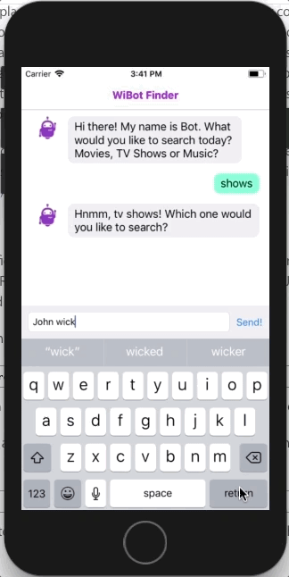

# WiBot Finder

This is an implementation of a simple **Chat Bot**, which will help you searching many titles amongst **Movies**, **TV Shows** and **Music** categories using the [iTunes Search API](https://affiliate.itunes.apple.com/resources/documentation/itunes-store-web-service-search-api/).

It uses Cocoapods for dependency manager. The dependencies are the following:

 - **Alamofire** for network requests
 - **Marshal** for converting network results into models
 - **Kingfisher** for presenting and handling the display and caching of images
 - **Swinject** and **SwinjectStoryboard** for dependency injection

The app will show you the chat bot, which will interact to you by text in order to get which **category** and **query parameters** to pass into the iTunes API:

If there are results for your search, then you will be able to **click on the thumbnail** to get a bounce effect, or **click on the title** to preview it:

If there are no results to be shown, the app will present you an error message:

